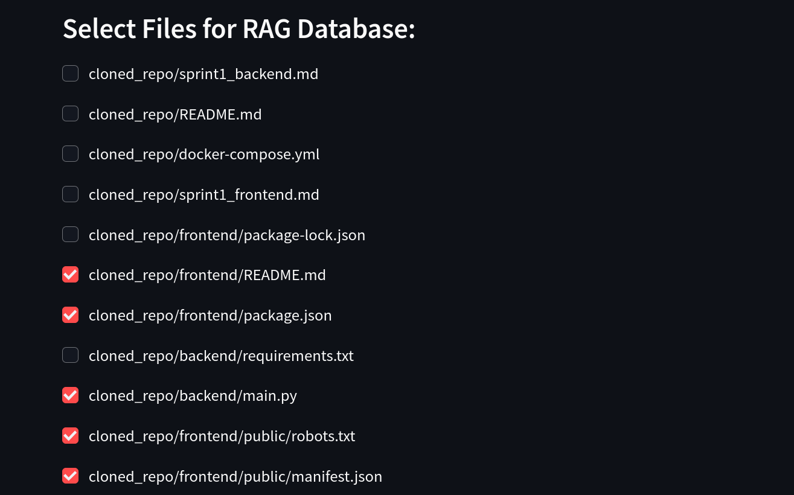
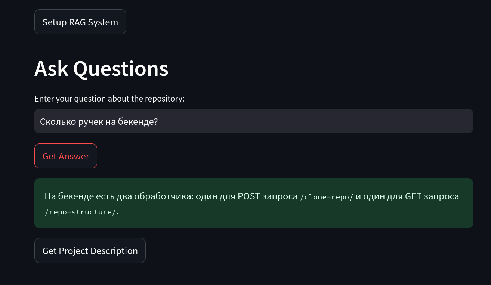
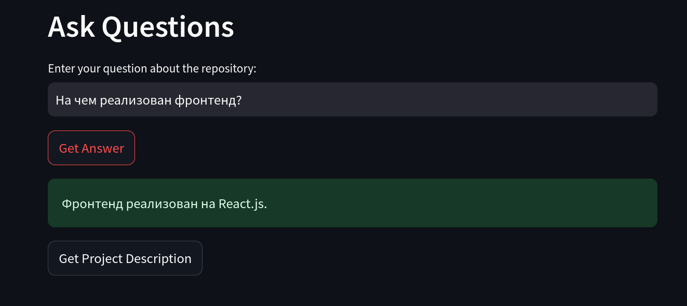
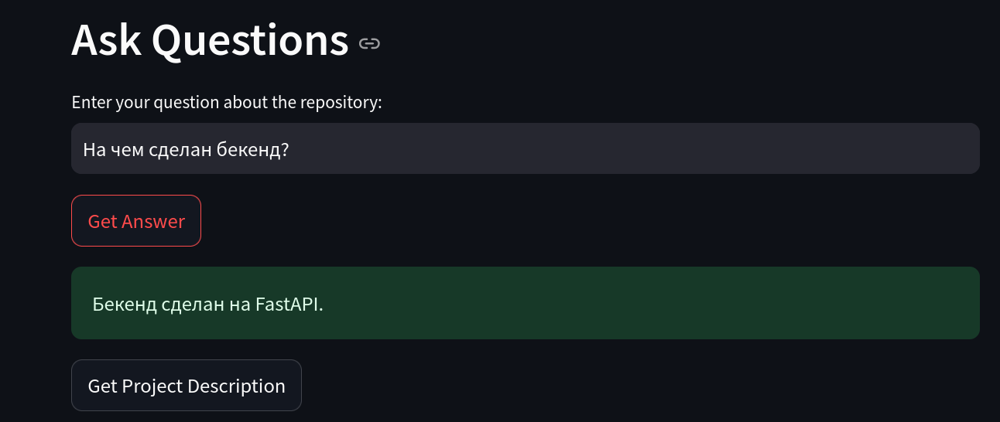
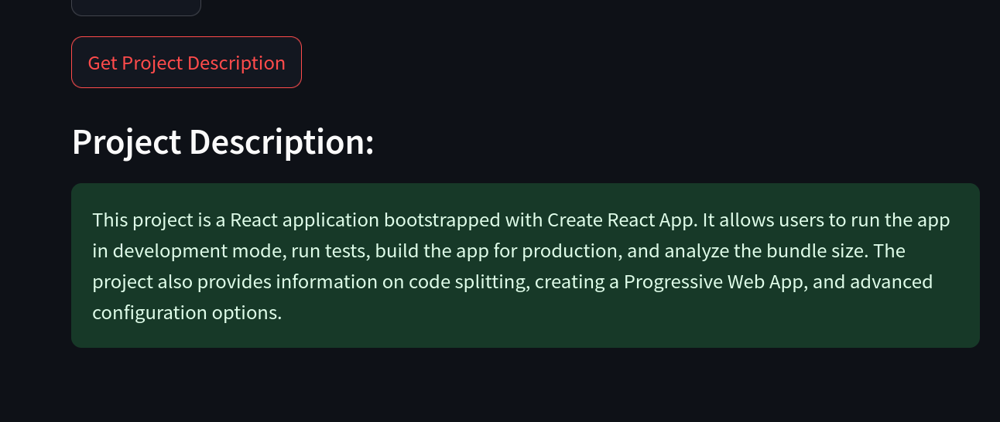

# github q&a rag

## Описание проекта

Это приложение, созданное на основе Streamlit, позволяет отвечать на вопросы по гитхаб репозиторию. Основная фишка - возможность выбора файлов проекта, по которым будут задаваться вопросы. 


## Установка и запуск

### 1. Клонируйте репозиторий
```bash
git clone https://github.com/PeMikj/streamlit-rag-app.git
cd streamlit-rag-app
```
### 2. Создайте и активируйте виртуальное окружение
```bash
python -m venv venv
source venv/bin/activate
```
### 3. Установите зависимости
```bash
pip install -r requirements.txt
```
### 4. Запустите приложение
```bash
streamlit run app.py
```
Для тестирования вам понадобится специальный ключ. 
Либо же можно поменять импорты и при наличии использовать ключ от OpenAI.

## Интерфейс и валидация
## Примеры:

--------------------------------------------------------------------------------------------------------------------

--------------------------------------------------------------------------------------------------------------------

--------------------------------------------------------------------------------------------------------------------

--------------------------------------------------------------------------------------------------------------------

--------------------------------------------------------------------------------------------------------------------


### Автор
Михайлов Петр
